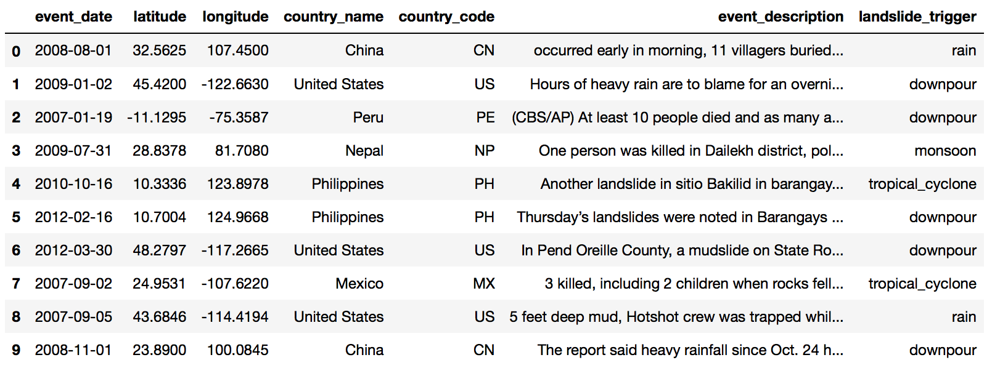
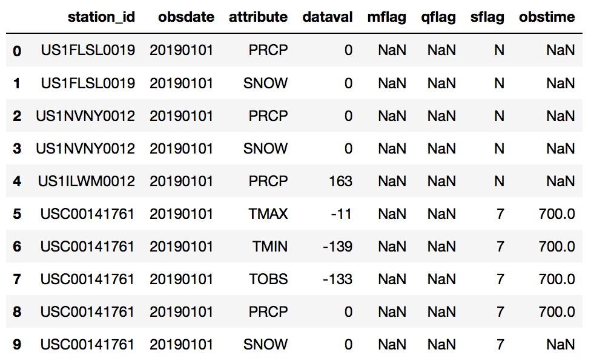
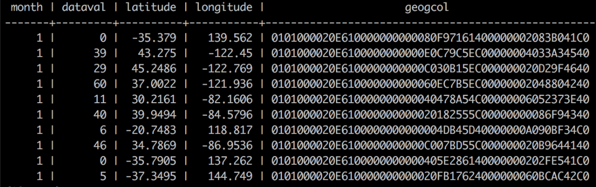
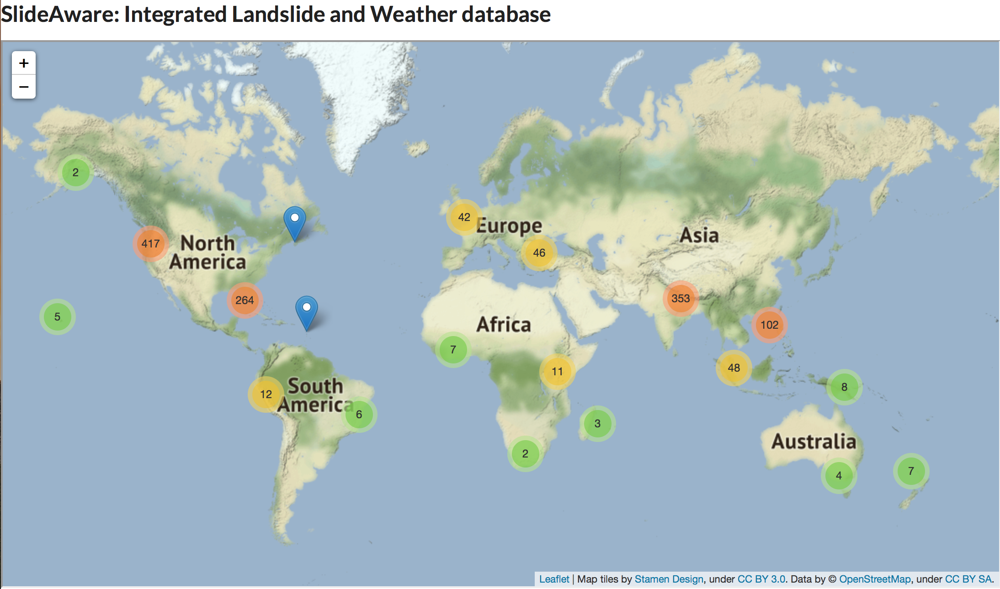
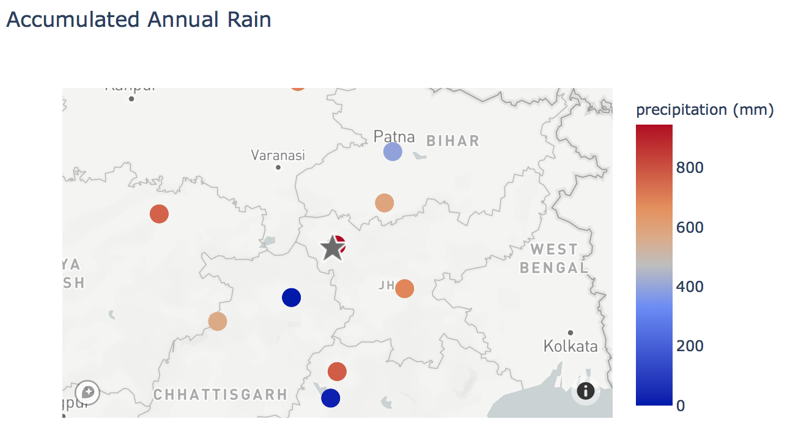

# SlideAware: Integrating global landslide and weather data for hazard insight
The goal of this project is to build a data pipeline to integrate global landslide and weather information into one database with an interactive web platform for data query and visualization.

## Table of Contents
- [Introduction](#introduction)
- [Data Sets](#datasets)
- [Data Pipeline](#datapipeline)
	- [Data Ingestion](#dataingestion)
	- [Data Transformation](#datatransformation)
	- [Data Loading](#dataloading)
	- [Data Visualization](#datavisualization)
- [Instructions to Run this Pipeline](#instructions)

<a name="introduction"></a>
## Introduction
Landslides are the most widespread geological hazard and can occur anywhere in the world [[link](https://www.who.int/health-topics/landslides#tab=tab_1)]. In the US, for example, there were over 3000 landslide incidents in the past 10 years, causing life and economic losses. Despite the significant impact of this natural disaster on society, its information is largely lacking with few to be easily found and accessible to the general public, and no centralized and up-to-date dataset is available. On the other hand, weather information, such as temperature, precipitation, snow, etc, has been recorded and distributed for more than 100 years, and the world has seen a steady increase of weather stations worldwide since the 1960's, leading to a global network of 110,000+ stations and more comprehensive coverage of weather information.

Research has shown that intense/continuous rainfall is one of the major natural triggers for landslide occurrence, and can offer much insight into hazard susceptibility in vulnerable regions [[link](https://earthdata.nasa.gov/learn/sensing-our-planet/connecting-rainfall-and-landslides)]. The vision of this project is, therefore, to create an integrated global database of landslide and precipitation data, to fill the information gap, increase hazard awareness and preparedness, and faciliate hazard assessment and mitigation efforts.  

<a name="datasets"></a>
## Data Sets
The global landslide catalog used in the project is compiled by NASA, documenting 11,000+ landslide events in 138 countries from 1988 to 2017. The weather data is retrieved from the Global Historical Climatological Network Daily dataset (GHCN-D), hosted by NOAA.

An example of selected columns of the landslide catalog is shown below.

<p align="center">

</p>

The daily global weather data is compiled into 1.2G yearly CSV file.

<p align="center">

</p>

<a name="datapipeline"></a>
## Data Pipeline
The data ETL pipeline used in this project, shown below, is entirely hosted on AWS EC2 instances and consists of a Spark cluster, PostgreSQL database, and Dash web platform.

<!---->
<p align="center">

</p>

<a name="dataingestion"></a>
### Data Ingestion (S3, EC2)
The weather data is retrieved from NOAA's public ftp site and then uploaded to AWS S3, to be extracted for later batch processing. The landslide catalog is stored in an EC2 instance directly for in situ processing. 

<a name="datatransformation"></a>
### Data Transformation (Spark, Python)
Spark is used to carry out a series of data transformation steps on the historical weather dataset.
- Filter: Retain the precipitation attribute with good quality control indicator; remove other attributes for the purpose of this project.
- Group and aggregate: Group the daily data per month per station, and aggregate the precipitation value to obtain monthly accumulated amount. 

The landslide catalog is processed by Python Pandas to retain selected columns to be stored in the database.

<a name="dataloading"></a>
### Data Loading (PostgreSQL, PostGIS)
The transformed data is written into tables and stored in PostgreSQL database with PostGIS extension, adding geography attribute to the coordinate of weather station location. The geography attribute is used for faster searching of geospatial coordinates. The stored data can be retrieved by user query through the front-end platform.

An example of the resultant yearly weather table is shown below.

<p align="center">

</p>

<a name="datavisualization"></a>
### Data Visualization (Dash)
Dash is used to build a front-end interactive platform that visualizes the global landslide locations and, by user query of any specific landslide incident, returns associated precipitation data from weather stations near that location.

[Link to A short video demo](https://www.youtube.com/watch?v=-8xX-kZtufU)

- A screenshot of the zoomable global map showing locations of landslide events:

<p align="center">

</p>

- User input of landslide location (latitude/longitude) and year returns a map showing the landslide location and accumulated rainfall data from nearby weather stations.

<p align="center">

</p>

<a name="instructions"></a>
## Instructions to run this pipeline
- Python packages required: pandas, numpy, psycopg2, folium, dash
- For landslide catalog preprocessing, run command: ```python3 slide_preprocess.py```
- For weather data batch processing, run command:
```spark-submit --packages com.amazonaws:aws-java-sdk:1.7.4,org.apache.hadoop:hadoop-aws:2.7.7 --master spark://<master DNS>:7077 batch_process.py```
- For landslide catalog processing, run command: ```python3 slide_process.py```
- For dash web platform, run command: ```python3 app.py``` 
